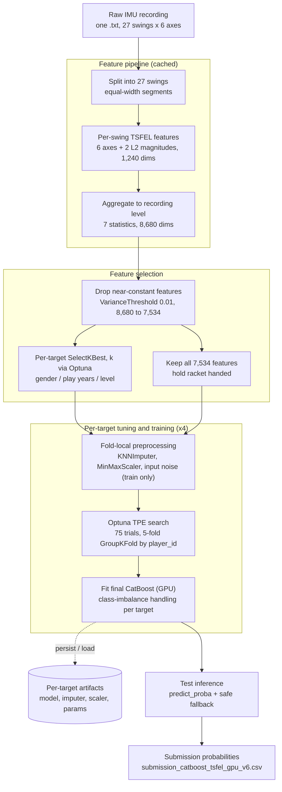

# AI CUP 2025 Spring — Smart Racket Table Tennis Classification

[](https://tbrain.trendmicro.com.tw/Competitions/Details/39)
[](aicup_submission.ipynb)
[](#final-result)

Competition submission for the AI CUP 2025 Spring smart-racket challenge. The task is to predict four
table-tennis player attributes from six-axis IMU swing recordings:

- `gender`
- `hold racket handed`
- `play years`
- `level`

This repository is the **original competition entry**: a single, self-contained notebook
([aicup_submission.ipynb](aicup_submission.ipynb)) that produced the leaderboard result below. A
post-competition redesign — with leakage-safe nested evaluation, paired bootstrap confidence intervals,
and a reproducible, cost-gated experiment framework — lives in a separate repository:

> **Redesign:** [smart-racket-imu-classification](https://github.com/Guancheng1206/smart-racket-imu-classification)

If you want the stricter, framework-style treatment of the same problem, read that repo. This one is the
honest record of what was actually submitted.

## Final result

**Mean 5-fold GroupKFold CV AUC 0.8296; Private Leaderboard ROC AUC 0.806.**

| Target | Metric | Optuna best CV AUC |
| --- | --- | ---: |
| `gender` | ROC AUC | 0.7963 |
| `hold racket handed` | ROC AUC | 0.9996 |
| `play years` | micro-OvR ROC AUC | 0.6629 |
| `level` | micro-OvR ROC AUC | 0.8595 |
| **mean** | — | **0.8296** |

The headline metric is the arithmetic mean of the four per-target AUCs, matching the competition's
scoring. The CV column reports each target's best Optuna trial value on the internal 5-fold
`GroupKFold`.

> **Read these numbers honestly.** The CV scores are the *best Optuna trial* values, i.e. hyperparameter
> selection and evaluation share the same folds, so the CV column is optimistic relative to a truly
> outer-fold-honest estimate. The TSFEL sampling-rate constant here is `fs = 50 Hz`, which the redesign
> later found to be wrong for this hardware (~85 Hz). Both issues are exactly what the
> [redesign repo](https://github.com/Guancheng1206/smart-racket-imu-classification) was built to fix; the
> Private Leaderboard number (0.806) is the only fully out-of-sample figure here.

## How it works



Intermediate TSFEL features and the four per-target artifacts are cached to disk. With
`USE_SAVED_MODELS = True` the notebook loads existing artifacts and skips training, so a re-run only
regenerates the test predictions. `SelectKBest` is applied per target to `gender` / `play years` /
`level`; `hold racket handed` keeps all 7,534 features.

## Dataset

Each recording (`unique_id`) is a raw `.txt` file containing six-axis IMU time series:

- Accelerometer: `Ax`, `Ay`, `Az`
- Gyroscope: `Gx`, `Gy`, `Gz`

Each recording contains 27 swings. Datasets are **not** committed.

```text
39_Training_Dataset/
  train_info.csv
  train_data/{unique_id}.txt

39_Test_Dataset/
  test_info.csv
  sample_submission.csv
  test_data/{unique_id}.txt
```

Training metadata columns:

```text
unique_id, player_id, mode, gender, hold racket handed, play years, level, cut_point
```

`player_id` is the grouping key used for leakage-safe cross-validation. This notebook segments each
recording into 27 equal-width windows with `np.linspace` (it does **not** use the `mode` covariate or the
`cut_point` split indices — both are available for future work).

| Dataset | Recordings | Players |
| --- | ---: | ---: |
| Training | 1,955 | 42 |
| Test | 1,430 | — |

## Evaluation protocol

- Single 5-fold `GroupKFold`, grouped by `player_id`, so a player never appears in both train and
  validation within a fold.
- Per-target hyperparameter search with Optuna TPE: 75 trials each (300 total across four targets),
  pruned by `MedianPruner` and capped at a 2.5-hour wall-clock timeout per study.
- Competition AUC per target: ROC AUC for the binary targets, micro-OvR ROC AUC for the multiclass
  targets.
- Mean AUC across the four targets as the headline metric.

This protocol is the competition-era validation. It controls player leakage in the cross-validation
folds, but — unlike the redesign — hyperparameter selection and reporting share the same folds, and there
is a single split with no nested loop and no uncertainty estimate. Treat the CV numbers as a development
signal, not as an unbiased generalization estimate.

## Model overview

A single modeling approach, trained independently for each of the four targets.

**Features.** Each recording is split into 27 swing segments. For every segment, TSFEL extracts temporal,
spectral, and statistical features from the 6 raw axes plus 2 L2 magnitudes (acceleration and gyroscope),
giving 1,240 per-segment dimensions. The 27 segments are aggregated with 7 statistics
(`mean / std / median / min / max / skew / kurtosis`) into an 8,680-dim recording-level vector.

**Selection.** `VarianceThreshold(0.01)` removes near-constant columns (8,680 -> 7,534). For `gender`,
`play years`, and `level`, an additional `SelectKBest(f_classif)` is applied, with `k` tuned by Optuna
(lower bound 20, upper bound the number of available features); each target keeps its own feature subset.
`hold racket handed` uses all 7,534 features.

**Learner.** A per-target `CatBoostClassifier` (`task_type='GPU'`) with fold-local `KNNImputer(5)` and
`MinMaxScaler`, optional train-only Gaussian input noise, and early stopping. Class imbalance is handled
with `scale_pos_weight` for `gender` and optional balanced class weights for `play years` / `level`
(toggled by Optuna).

Per-target Optuna best CV AUC:

| Target | Metric | Optuna best CV AUC |
| --- | --- | ---: |
| `gender` | ROC AUC | 0.7963 |
| `hold racket handed` | ROC AUC | 0.9996 |
| `play years` | micro-OvR ROC AUC | 0.6629 |
| `level` | micro-OvR ROC AUC | 0.8595 |
| **mean** | — | **0.8296** |

## Engineering highlights

- Per-target Optuna TPE tuning (75 trials each) with `MedianPruner` and a 2.5-hour timeout per study.
- Player-grouped 5-fold `GroupKFold` to avoid player leakage in cross-validation.
- Fold-local `KNNImputer` + `MinMaxScaler` and train-only input-noise regularization.
- Per-target feature selection (`VarianceThreshold` + Optuna-tuned `SelectKBest`).
- Class-imbalance handling: `scale_pos_weight` (`gender`) and optional balanced class weights
  (`play years` / `level`).
- Cached TSFEL features and persisted per-target artifacts (model / imputer / scaler / params), with
  `USE_SAVED_MODELS` for fast re-runs.
- Defensive inference fallbacks (binary `0.5`, multiclass `1 / n_classes`) so one bad recording cannot
  break the whole submission.
- GPU training via CatBoost `task_type='GPU'`.

## Project structure

```text
.
aicup_submission.ipynb                      # the entire pipeline (one notebook)
README.md
.gitignore

# generated at runtime, gitignored (not committed):
39_Training_Dataset/                        # official training data
39_Test_Dataset/                            # official test data
tabular_data_train_tsfel_catboost_gpu_v6/   # cached TSFEL segment features (train)
tabular_data_test_tsfel_catboost_gpu_v6/    # cached TSFEL segment features (test)
trained_models_catboost_v6/                 # per-target artifacts (.cbm / .joblib / .json)
submission_catboost_tsfel_gpu_v6.csv        # final submission
```

## Setup

```bash
pip install numpy pandas scikit-learn catboost optuna tsfel joblib jupyterlab
```

Requirements:

- Python 3.8+
- An NVIDIA GPU + CUDA (CatBoost `task_type='GPU'`).

## Running

1. Place `39_Training_Dataset/` and `39_Test_Dataset/` at the repository root.
2. Run all cells of [aicup_submission.ipynb](aicup_submission.ipynb).

Intermediate features and model artifacts are cached, so subsequent runs skip the expensive steps. To
**retrain from scratch**, set `USE_SAVED_MODELS = False` near the top of the notebook, or delete
`trained_models_catboost_v6/` and the two `tabular_data_*/` cache folders.

Main tunable constants:

| Constant | Default | Meaning |
| --- | --- | --- |
| `NUM_TOTAL_SEGMENTS_PER_FILE` | 27 | Swing segments per recording |
| `N_SPLITS_GROUPKFOLD` | 5 | GroupKFold folds |
| `OPTUNA_N_TRIALS` | 75 | Optuna trials per target |
| `TSFEL_SAMPLING_FREQ` | 50 | TSFEL sampling-rate constant (see caveat above) |
| `USE_SAVED_MODELS` | `True` | Load saved artifacts and skip training |

## Honest interpretation

What carried the result was not a single clever trick but a few solid choices:

1. Player-grouped cross-validation, so the CV signal is not inflated by per-player leakage.
2. Fold-local preprocessing (impute / scale) fitted only on training folds.
3. A rich TSFEL representation aggregated to the recording level.
4. Per-target feature selection and per-target Optuna tuning rather than one shared configuration.

The honest limitations — and the reason the redesign exists:

- The reported CV is the best Optuna trial value, so model selection and evaluation share folds; it is
  optimistic, not outer-fold-honest.
- A single split, with no nested CV and no uncertainty estimate (no bootstrap confidence intervals), over
  only 42 players.
- `TSFEL_SAMPLING_FREQ = 50` is incorrect for this hardware (~85 Hz); it is a shared constant, so it
  shifts the numbers only slightly, but it is still a known defect.
- Everything lives in one notebook, which makes testing and reproduction harder.

All four are addressed in the
[redesign repository](https://github.com/Guancheng1206/smart-racket-imu-classification).

## Data & license

The AI CUP competition datasets are **not** included or redistributed here and remain subject to their
original competition terms. No separate code-license file is provided in this repository.

## References

- CatBoost: <https://catboost.ai>
- TSFEL: <https://tsfel.readthedocs.io>
- Optuna: <https://optuna.org>
- scikit-learn: <https://scikit-learn.org>

Generative AI assistance was used while preparing this documentation.
