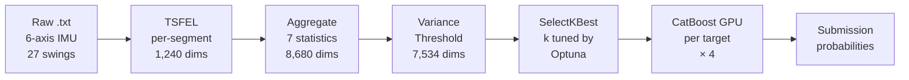

# AI CUP 2025春季賽－桌球智慧球拍資料的精準分析競賽

**競賽頁面**:[T-Brain Competition #39](https://tbrain.trendmicro.com.tw/Competitions/Details/39)
最終成績的評量項目包括兩部分：(1).該隊伍於Private Leaderboard之排名，佔80%比重；及(2).報告，佔20%。
評量標準包括三部分：(1). 報告完整性(8%)、(2). 報告正確性(8%)、與(3).程式原創性(4%)。由教育部人工智慧競賽與標註資料蒐集計畫辦公室之專家委員組成之評審團隊，進行評分。

<br>

---

## 任務

從六軸 IMU 揮拍訊號預測桌球選手的四項屬性。每筆 recording 為一個 `.txt` 檔,內含 27 次揮拍的連續六軸時序資料(三軸加速度 `Ax/Ay/Az`、三軸角速度 `Gx/Gy/Gz`)。

| 目標                 | 類別數 | 評估指標             |
| -------------------- | -----: | -------------------- |
| `gender`             |      2 | ROC AUC              |
| `hold racket handed` |      2 | ROC AUC              |
| `play years`         |      3 | Micro-OvR ROC AUC    |
| `level`              |      4 | Micro-OvR ROC AUC    |

最終分數為四項指標之**算術平均**。

| 資料集     | Recordings | Players |
| ---------- | ---------: | ------: |
| Training   |      1,955 |      42 |
| Test       |      1,430 |       — |

<br>

---

## Pipeline



<br>

---

## 方法

### 特徵抽取

每筆 `.txt` 平均切成 27 個 swing segment。每個 segment 對 6 軸原始訊號 + 2 個 L2 magnitude(加速度合成、角速度合成)以 **TSFEL** 抽取時序特徵(時域 + 頻域 + 統計域),per-segment 1,240 維。27 個 segment 經 7 種統計量聚合為 recording-level 特徵向量:

```
8,680 維 = 1,240 (TSFEL per segment) × 7 (mean / std / median / min / max / skew / kurtosis)
```

### 特徵篩選

- `VarianceThreshold(0.01)` 全域移除近常數欄位:**8,680 → 7,534 維**
- `SelectKBest(f_classif)` 對 `gender` / `play years` / `level` 三個 target 再次篩選
- `k` 由 Optuna 搜尋,下界 20、上界為當前可用特徵數
- 每個 target 各自得到獨立的特徵子集,並隨模型一同 persist

### 模型

四個 target 各訓練獨立的 `CatBoost`(`task_type='GPU'`)分類器。

| 元件               | 設定                                                     |
| ------------------ | -------------------------------------------------------- |
| Imputer            | `KNNImputer(n_neighbors=5)`                              |
| Scaler             | `MinMaxScaler`                                           |
| `gender` 不平衡     | Optuna 搜尋 `scale_pos_weight`,以多數/少數樣本比(0.83 / 0.17 ≈ 4.96)為中心 |
| `play years / level` 不平衡 | 由 Optuna 決定是否啟用 fold-local balanced class weights(啟用時每折以 train labels 計算) |

### 訓練策略

- **Early stopping**:每個 fold 訓練時以 validation fold 監控,`early_stopping_rounds`(40–100,step=10)本身納入 Optuna 搜尋空間
- **輸入噪聲正則化**:`add_input_noise`(true / false)與 `noise_level`(1e-4 – 2e-2,log scale)皆由 Optuna 決定
- 噪聲**僅施加於訓練資料**,不污染 validation

### 評估與調參

以 **`player_id` 分組的 5-fold `GroupKFold`**,確保同一選手不會同時出現在 train 與 validation。

Optuna TPE 對每個 target 跑 **75 trials**(總計 300 trials),搜尋空間:

| 類別           | 超參數                                                                                                                                                                       |
| -------------- | ---------------------------------------------------------------------------------------------------------------------------------------------------------------------------- |
| CatBoost       | `iterations` (500–2,500)、`learning_rate` (5e-4 – 5e-2, log)、`depth` (3–6)、`l2_leaf_reg`、`border_count`、`random_strength`、`bagging_temperature`、`early_stopping_rounds` |
| 預處理 / 正則化 | `SelectKBest` 的 `k`、輸入噪聲開關與強度                                                                                                                                       |
| 不平衡處理      | `gender` 的 `scale_pos_weight`、`play years / level` 是否啟用 balanced class weights                                                                                          |

**計算成本控制**:
- `MedianPruner(n_startup_trials=7, n_warmup_steps=1)` 提前終止明顯低於中位數的試驗
- 每個 study 設定 2.5 小時 wall-clock timeout 上限

### 模型 Persistence

每個 target 訓練後 persist **四項 artifact**:

```
trained_models_catboost_v6/
├── catboost_model_{target}.cbm        # CatBoost 模型
├── imputer_{target}.joblib            # KNNImputer
├── scaler_{target}.joblib             # MinMaxScaler
└── best_params_meta_{target}.json     # Optuna 最佳參數 + 選出的特徵名
```

`USE_SAVED_MODELS = True` 時自動載入,跳過訓練,支援只更新測試集預測的快速迭代。

### 推論 Fallback

測試階段對缺失特徵檔、空 segment、或聚合失敗的 recording 採用合理預設機率,避免單筆故障導致整份 submission 失敗:

- Binary target:`0.5`
- Multi-class target:`1 / n_classes`

<br>

---

## 結果

### Optuna Best CV Scores

每個 target 在內部 5-fold CV 上的最佳分數:

| 目標                 |   Best CV |
| -------------------- | --------: |
| `gender`             |    0.7963 |
| `hold racket handed` |    0.9996 |
| `play years`         |    0.6629 |
| `level`              |    0.8595 |
| **mean**             | **0.8296** |

### Private Leaderboard

> **ROC AUC: 0.806**

<br>

---

## 專案結構

```
.
├── 39_Training_Dataset/                         # 官方訓練資料(未納入 repo)
├── 39_Test_Dataset/                             # 官方測試資料(未納入 repo)
├── aicup_submission.ipynb                       # 主執行 notebook
│
├── tabular_data_train_tsfel_catboost_gpu_v6/    # TSFEL segment 特徵 cache(自動)
├── tabular_data_test_tsfel_catboost_gpu_v6/     # TSFEL segment 特徵 cache(自動)
│
├── trained_models_catboost_v6/                  # 訓練後 artifacts(自動)
│   ├── catboost_model_{target}.cbm
│   ├── imputer_{target}.joblib
│   ├── scaler_{target}.joblib
│   └── best_params_meta_{target}.json
│
└── submission_catboost_tsfel_gpu_v6.csv         # 最終提交檔(自動)
```

<br>

---

## 環境與執行

<details>
<summary><b>環境需求</b></summary>

- Python 3.8+
- NVIDIA GPU + CUDA(CatBoost `task_type='GPU'`)

```bash
pip install numpy pandas scikit-learn catboost optuna tsfel joblib jupyterlab
```

</details>

<details>
<summary><b>執行步驟</b></summary>

1. 將 `39_Training_Dataset/` 與 `39_Test_Dataset/` 放在 repo 根目錄
2. 在 Jupyter 中執行 `aicup_submission.ipynb` 所有 cells

中間特徵與模型 artifacts 會自動 cache,重複執行時跳過耗時步驟。

**重新訓練**:設定 notebook 開頭 `USE_SAVED_MODELS = False`,或直接刪除 `trained_models_catboost_v6/` 與兩個 `tabular_data_*/` 資料夾。

</details>

<details>
<summary><b>主要可調參數</b></summary>

| 參數                          | 預設   | 說明                              |
| ----------------------------- | ------ | --------------------------------- |
| `NUM_TOTAL_SEGMENTS_PER_FILE` | 27     | 每筆訊號切分的 segment 數         |
| `N_SPLITS_GROUPKFOLD`         | 5      | GroupKFold 折數                   |
| `OPTUNA_N_TRIALS`             | 75     | 每個 target 的 Optuna 試驗次數    |
| `TSFEL_SAMPLING_FREQ`         | 50     | TSFEL 的取樣率參數                |
| `USE_SAVED_MODELS`            | `True` | 是否載入已存模型跳過訓練          |

</details>
